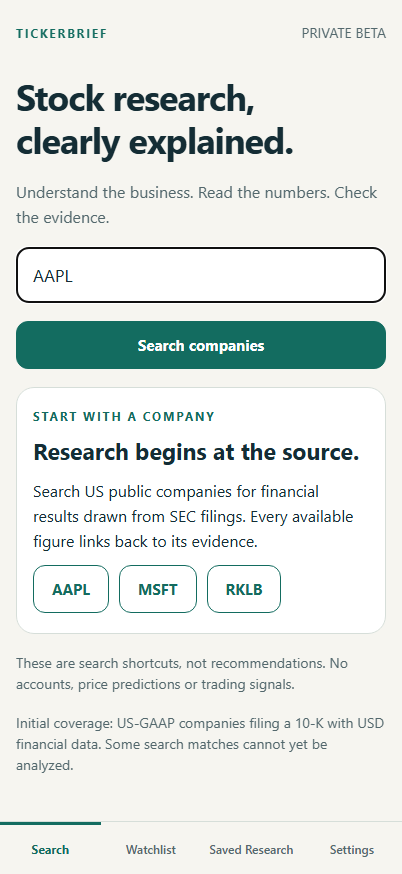
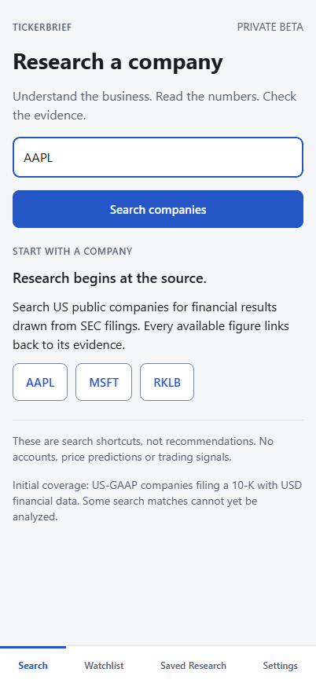
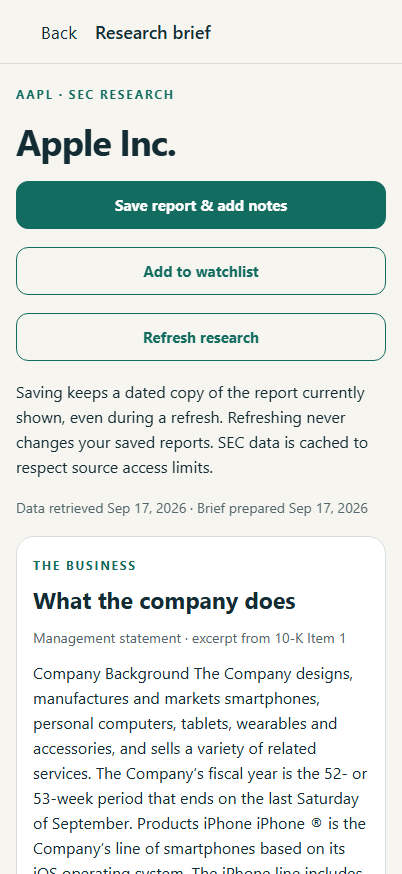
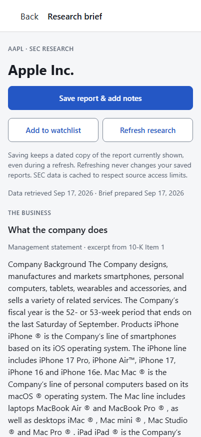
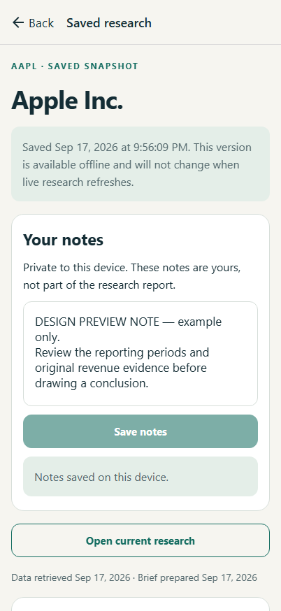
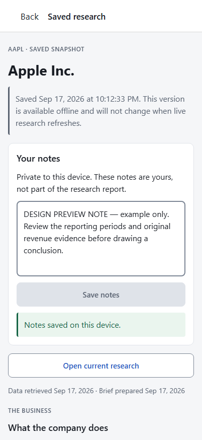

# TickerBrief visual review

**Chromium browser previews, not physical iPhone screenshots.** Baseline: `58f3cc1` on `feat/private-beta`, after stabilization was delivered as TestFlight 0.1.0 (3). The redesign has not been cloud-built or uploaded. Native review remains pending.

## Before and after

Both stages use a 402 × 874 browser viewport and the same recorded real AAPL report from the hosted backend. The preview note is explicitly an example, created in isolated browser storage; it is not an existing user's note. Click images to view their original size.

| Screen | Before | After |
| --- | --- | --- |
| Search | [](before/search.png) | [](after/search.png) |
| Populated report | [](before/report.png) | [](after/report.png) |
| Saved notes | [](before/saved-notes.png) | [](after/saved-notes.png) |

Additional views: [financial values before](before/report-values.png) / [after](after/report-values.png), [evidence](after/evidence.png), [Watchlist](after/watchlist.png), [Saved Research](after/saved.png), [Settings](after/settings.png).

Enlarged text, **2× CSS approximation only**: [320 px Search](after/search-320-2x.png), [430 px Search](after/search-430-2x.png), [320 px notes](after/saved-notes-320-2x.png), [430 px notes](after/saved-notes-430-2x.png). Browser scaling does not exercise React Native's native `fontScale`, safe areas or Dynamic Type. On native devices, related actions stack and tabs use two columns above font scale 1.4. Long financial values remain individually scrollable, preserving every digit.

## Design choices and contrast

The palette lives in `apps/mobile/src/components/colors.json`; `theme.ts` supplies semantic colors, system-font type sizes, spacing and radii. Shared sections replace unnecessary cards. A reporting period groups its related metrics; notes and individual evidence records retain white containers. Filled blue buttons identify primary actions; outlined buttons identify secondary actions. Error, warning and success colors always accompany explanatory text.

Title 28/34, section heading 18/26, body 16/24, secondary label 14/20, financial value 20/28. Financial values use tabular numerals. No text-scaling cap, ellipsis or forced shrinking was added to values. Registered app identity, backend configuration, storage schema, API behavior and navigation destinations are unchanged.

The [WCAG 2.2 contrast guidance](https://www.w3.org/WAI/WCAG22/Understanding/contrast-minimum.html) requires 4.5:1 for normal text and 3:1 for large text. This design tests **all text at 4.5:1**, without taking the large-text exception. [Non-text control contrast](https://www.w3.org/WAI/WCAG22/Understanding/non-text-contrast.html) is checked at 3:1. The calculator compares unrounded ratios; these displayed figures are rounded for reading.

| Foreground / background | Ratio |
| --- | ---: |
| Primary text / white | 17.08:1 |
| Primary text / page | 15.80:1 |
| Secondary labels and placeholders / white | 6.17:1 |
| Secondary labels / page | 5.70:1 |
| Blue action / white, or white / blue action | 6.47:1 |
| Blue / page | 5.99:1 |
| Blue / pressed secondary action | 5.72:1 |
| White / pressed primary action | 8.62:1 |
| Error / error surface | 6.49:1 |
| Warning / warning surface | 6.01:1 |
| Success / success surface | 6.49:1 |
| Disabled text / disabled surface | 4.79:1 |
| Input border / white | 3.73:1 |
| Input border / page | 3.45:1 |

The pale divider is decorative; the darker input-border token marks input and secondary-button boundaries. Focus uses the primary action color. Contrast checks alone do not establish full WCAG conformance.

## Review locally on Windows

If Metro is already running on port 8081, open **http://127.0.0.1:8081**. Otherwise, in PowerShell:

```powershell
Set-Location 'C:\Users\JEMJR\OneDrive\Desktop\TickerBrief\apps\mobile'
$env:EXPO_PUBLIC_API_URL = 'https://tickerbrief-api.onrender.com'
$env:IOS_BUNDLE_IDENTIFIER = 'com.jeppyinvesting.tickerbrief'
npx.cmd expo start --web --port 8081 --clear
```

Use a separate browser profile for review if you want to keep browser-preview notes separate. The normal app uses the real hosted backend; a free-service cold start may take time. Search AAPL, open the report and evidence, save a snapshot and add a review note. Open Saved Research to return to that snapshot. Browser storage is separate from the iPhone installation. Do not uninstall the iPhone app or clear its storage.

If an old tab is blank, press **Ctrl+Shift+R** at the same address and allow the development bundle to compile. Observed rebuilds took 25–31 seconds. The web shell now shows **Loading TickerBrief** before the app starts and offers a same-page reload link. Do not clear browser/site storage; a hard refresh preserves it. This startup interval is separate from a later hosted research request or Render cold start.

Use browser responsive mode at 320, 402 and 430 pixels. The screenshot script is a separate review harness: it intercepts requests only in its disposable Chromium context and replays the captured public AAPL response. It is never imported by the app. `before` captures the current checkout and refreshes the ignored response cache; do not rerun it over the committed baseline screenshots unless intentionally replacing that baseline. `after` uses the existing ignored capture and makes no live research request:

```powershell
npx.cmd tsx scripts/design-preview.ts after
npx.cmd tsx scripts/check-contrast.ts
```

The cached response is deliberately excluded from Git. On a fresh checkout, view the committed screenshots or use the normal app to retrieve a current report; the reproduction script needs that local capture to reproduce these exact numbers/dates. [Before capture metadata](before/capture.json) and [after metadata](after/capture.json) record the shared report identifier, dates and input styles.

## Verification boundaries

- Existing suite: 10 browser scenarios passed; the new tab-label regression passed separately. Long/negative current, prior and source amounts pass at 320/402/430 pixels and 1×/2×/2.5× CSS scaling. Saved reports/excerpts and edited notes survive two browser-process restarts with external networking blocked; local Metro still supplies app assets.
- Six unit tests, TypeScript, ESLint, formatting and Windows iOS Hermes export passed. Resolved Expo identity is unchanged. Contrast script verifies 17 token pairs, including placeholders, input boundaries, pressed and disabled actions. The capture script checks rendered input/placeholder/focus colors against the tokens. Final screenshots are visually inspected separately from these assertions.
- Screenshots replay one real hosted AAPL response; they are not a new AAPL/MSFT/RKLB filing audit. At capture, hosted health reported SEC configured and AI disabled, and AAPL interpretation remained disabled.
- No EAS build, submission, public release, tester invitation, billing change, backend deployment or live AI generation occurred. App identities and production submission settings remain unchanged.
- Physical iPhone verification remains pending: Dynamic Type, tab wrapping, safe areas, native Back/gestures, source scrolling, and saved data surviving an update. Keep the existing device observations and TestFlight milestones separate in [STATUS.md](../../STATUS.md).
